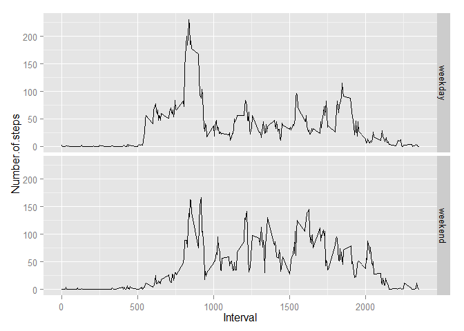

# Reproducible Research: Peer Assessment 1

This assignment makes use of data from a personal activity monitoring device. This device collects data at 5 minute intervals through out the day. The data consists of two months of data from an anonymous individual collected during the months of October and November, 2012 and include the number of steps taken in 5 minute intervals each day.

## Loading and preprocessing the data
We assume that source repo of Programming Assignment was forked and cloned. Therefore we have local copy of the source data file. So we start from reading it into R environment.


```r
unzip("../RepData_PeerAssessment1/activity.zip", exdir="../RepData_PeerAssessment1/data")
data<-read.csv("../RepData_PeerAssessment1/data/activity.csv")
```

Let's see what is inside the data


```r
summary(data)
```

```
##      steps                date          interval     
##  Min.   :  0.00   2012-10-01:  288   Min.   :   0.0  
##  1st Qu.:  0.00   2012-10-02:  288   1st Qu.: 588.8  
##  Median :  0.00   2012-10-03:  288   Median :1177.5  
##  Mean   : 37.38   2012-10-04:  288   Mean   :1177.5  
##  3rd Qu.: 12.00   2012-10-05:  288   3rd Qu.:1766.2  
##  Max.   :806.00   2012-10-06:  288   Max.   :2355.0  
##  NA's   :2304     (Other)   :15840
```

```r
str(data)
```

```
## 'data.frame':	17568 obs. of  3 variables:
##  $ steps   : int  NA NA NA NA NA NA NA NA NA NA ...
##  $ date    : Factor w/ 61 levels "2012-10-01","2012-10-02",..: 1 1 1 1 1 1 1 1 1 1 ...
##  $ interval: int  0 5 10 15 20 25 30 35 40 45 ...
```

```r
head(data,20)
```

```
##    steps       date interval
## 1     NA 2012-10-01        0
## 2     NA 2012-10-01        5
## 3     NA 2012-10-01       10
## 4     NA 2012-10-01       15
## 5     NA 2012-10-01       20
## 6     NA 2012-10-01       25
## 7     NA 2012-10-01       30
## 8     NA 2012-10-01       35
## 9     NA 2012-10-01       40
## 10    NA 2012-10-01       45
## 11    NA 2012-10-01       50
## 12    NA 2012-10-01       55
## 13    NA 2012-10-01      100
## 14    NA 2012-10-01      105
## 15    NA 2012-10-01      110
## 16    NA 2012-10-01      115
## 17    NA 2012-10-01      120
## 18    NA 2012-10-01      125
## 19    NA 2012-10-01      130
## 20    NA 2012-10-01      135
```

It looks like "date" variable need another format.

```r
class(data$date)
```

```
## [1] "factor"
```

```r
data$date<-as.Date(data$date)
class(data$date)
```

```
## [1] "Date"
```

Let's also make "date.time" variable in time (POSIXlt) format

```r
class(data$interval)
```

```
## [1] "integer"
```

```r
## This function uses the fact that "interval" variable contains info
## about minutes in units and tens, and hours in hundreds and thousands
conv_int <- function(date, time)
{
        hour <- time %/% 100
        min <- time %% 100        
        strptime(paste0(date," ",hour,":",min), "%Y-%m-%d %H:%M", tz="UTC")
}

data$date.time<-conv_int(data$date,data$interval)
class(data$date.time)
```

```
## [1] "POSIXlt" "POSIXt"
```


## What is mean total number of steps taken per day?

```r
library(plyr)
```

First we calculate and draw histogram total number of steps taken each day

```r
total.steps.per.day<-ddply(data,.(date),summarize,sum=sum(steps))
par(mar=c(4, 4, 1, 2))
hist(total.steps.per.day$sum, xlab="total number of steps taken each day", main="")
```

 

Here is the mean and median total number of steps taken per day

```r
mean(total.steps.per.day$sum, na.rm=TRUE)
```

```
## [1] 10766.19
```

```r
median(total.steps.per.day$sum, na.rm=TRUE)
```

```
## [1] 10765
```


## What is the average daily activity pattern?
We need the average number of steps taken, averaged across all days

```r
avg.steps.per.int<-ddply(data,.(interval),summarize,mean=mean(steps, na.rm=TRUE))
```

Now we draw time series plot of the 5-minute interval (x-axis) and the average number of steps taken, averaged across all days (y-axis)

```r
par(mar=c(4, 4, 1, 2))
plot(avg.steps.per.int$interval, avg.steps.per.int$mean, type="l", ylab="Avg steps per interval", xlab="Interval")
```

 

Let's find 5-minute interval, on average across all the days in the dataset, contains the maximum number of steps.

```r
avg.steps.per.int[avg.steps.per.int$mean==max(avg.steps.per.int$mean),]
```

```
##     interval     mean
## 104      835 206.1698
```
Therefore this interval is from 8:35:00 till 8:39:59


## Imputing missing values

Total number of missing values in the dataset. (From summary we know that NAs live only in "steps" variable)

```r
sum(is.na(data$steps))
```

```
## [1] 2304
```

We need to fill in all of the missing values in the dataset. Our strategy will be to use the mean value for that interval across all the days.
First we merge data with averages and create new dataset data2. Then fill the missing values.


```r
data2<-join(data,avg.steps.per.int, by="interval", type="left")
data2[is.na(data2$steps),]$steps<-round(data2[is.na(data2$steps),]$mean, digits=0)
```

Now we redraw histogram with filled missing data

```r
total.steps.per.day2<-ddply(data2,.(date),summarize,sum=sum(steps))
par(mar=c(4, 4, 1, 2))
hist(total.steps.per.day2$sum, xlab="total number of steps taken each day (filled NAs)", main="")
```

 

And calculate mean and median total number of steps taken per day

```r
mean(total.steps.per.day2$sum, na.rm=TRUE)
```

```
## [1] 10765.64
```

```r
median(total.steps.per.day2$sum, na.rm=TRUE)
```

```
## [1] 10762
```
As we see, these changes are very small. The impact of imputing missing data is the more smooth data and more informative plots.


## Are there differences in activity patterns between weekdays and weekends?

We need to differ weekdays and weekends


```r
Sys.setlocale("LC_ALL", "English")
```

```
## [1] "LC_COLLATE=English_United States.1252;LC_CTYPE=English_United States.1252;LC_MONETARY=English_United States.1252;LC_NUMERIC=C;LC_TIME=English_United States.1252"
```

```r
data2$day<-weekdays(data2$date.time)

data2[data2$day=="Monday",]$day<-"weekday"
data2[data2$day=="Tuesday",]$day<-"weekday"
data2[data2$day=="Wednesday",]$day<-"weekday"
data2[data2$day=="Thursday",]$day<-"weekday"
data2[data2$day=="Friday",]$day<-"weekday"
data2[data2$day=="Saturday",]$day<-"weekend"
data2[data2$day=="Sunday",]$day<-"weekend"

data2$day<-as.factor(data2$day)
```

Now we make a panel plot containing of the 5-minute interval (x-axis) and the average number of steps taken, averaged across all weekday days or weekend days (y-axis).


```r
avg.steps.per.int2<-ddply(data2,.(interval,day),summarize,mean=mean(steps))
names(avg.steps.per.int2)<-c("Interval","Day","Number.of.steps")
library(ggplot2)

qplot(Interval,Number.of.steps,data=avg.steps.per.int2,facets=Day~.,geom="line")
```

 


